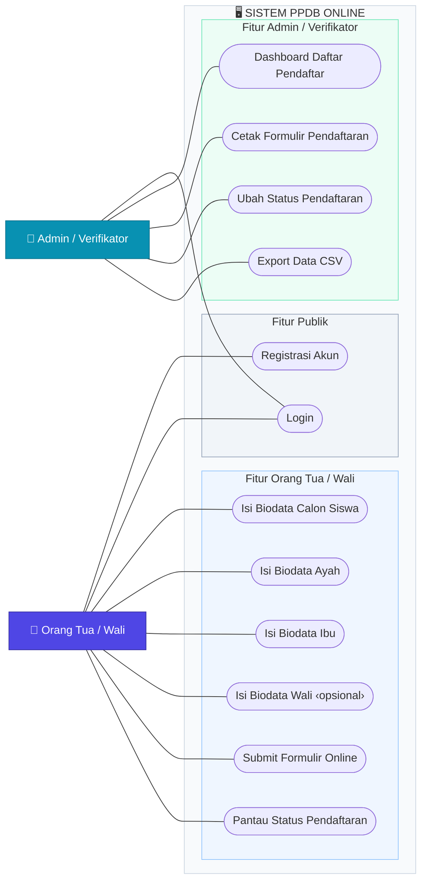
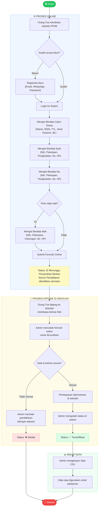
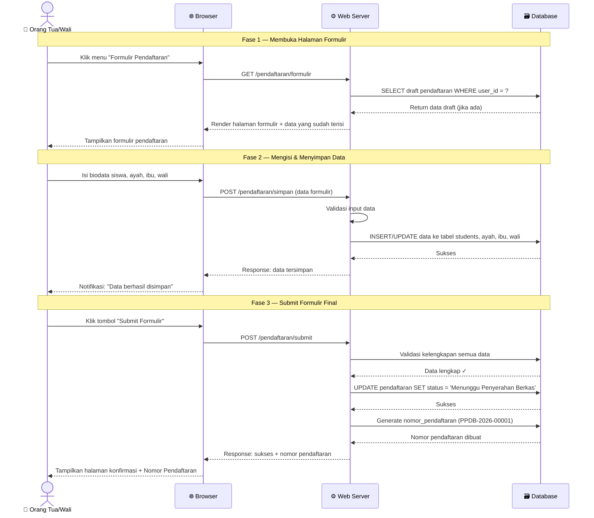
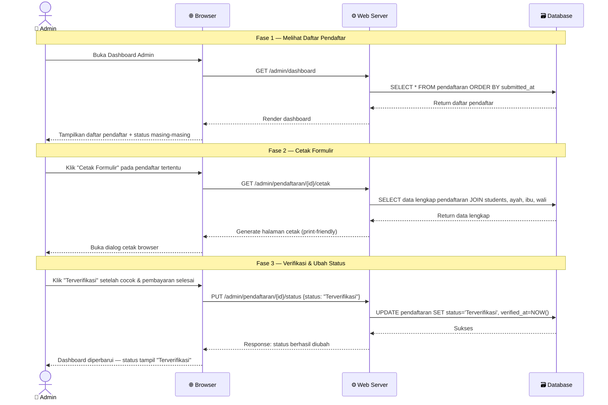
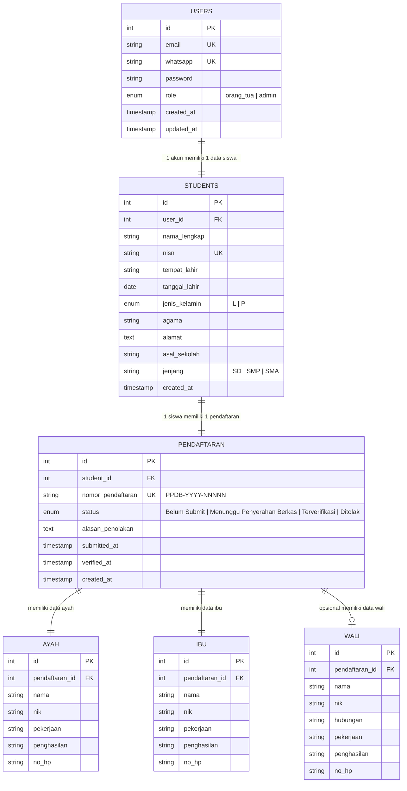
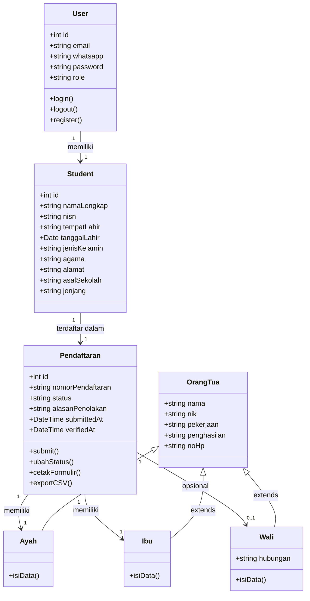

# 📐 Diagram UML — Sistem PPDB Online Sekolah Bhinneka

---

## 1. Use Case Diagram

Menggambarkan interaksi antara aktor sistem dengan fungsi-fungsi yang tersedia.

---

### Tabel Use Case Lengkap

| UC ID | Nama Use Case | Aktor | Deskripsi |
|-------|--------------|-------|-----------|
| UC-01 | Registrasi Akun | Orang Tua/Wali | Membuat akun baru dengan email, WhatsApp, dan password |
| UC-02 | Login | Orang Tua/Wali, Admin | Masuk ke sistem menggunakan email/WhatsApp + password |
| UC-03 | Isi Biodata Siswa | Orang Tua/Wali | Mengisi data lengkap calon siswa (nama, NISN, TTL, dll.) |
| UC-04 | Isi Biodata Ayah | Orang Tua/Wali | Mengisi data ayah kandung (NIK, pekerjaan, penghasilan, HP) |
| UC-05 | Isi Biodata Ibu | Orang Tua/Wali | Mengisi data ibu kandung (NIK, pekerjaan, penghasilan, HP) |
| UC-06 | Isi Biodata Wali | Orang Tua/Wali | Mengisi data wali (opsional, jika bukan orang tua kandung) |
| UC-07 | Submit Formulir | Orang Tua/Wali | Mengirimkan formulir online; status berubah otomatis |
| UC-08 | Pantau Status | Orang Tua/Wali | Melihat status pendaftaran secara real-time |
| UC-09 | Dashboard Pendaftar | Admin | Melihat daftar semua pendaftar beserta statusnya |
| UC-10 | Cetak Formulir | Admin | Mencetak formulir yang sudah diisi untuk dicocokkan berkas fisik |
| UC-11 | Ubah Status | Admin | Mengubah status: Terverifikasi / Ditolak (dengan alasan) |
| UC-12 | Export CSV | Admin | Mengunduh rekap data pendaftar dalam format CSV |

---

## 2. Activity Diagram

Menggambarkan alur aktivitas lengkap proses PPDB dari awal hingga selesai.

---

## 3. Sequence Diagram — Proses Submit Formulir

Menggambarkan urutan interaksi antar komponen saat orang tua submit formulir.

---

## 4. Sequence Diagram — Proses Verifikasi oleh Admin

---

## 5. Entity-Relationship Diagram (ERD)

Menggambarkan struktur database dan relasi antar tabel.

---

## 6. Class Diagram (Ringkas)

---

*Diagram UML ini dibuat untuk keperluan Laporan Kerja Praktik — Sistem PPDB Sekolah Bhinneka*
